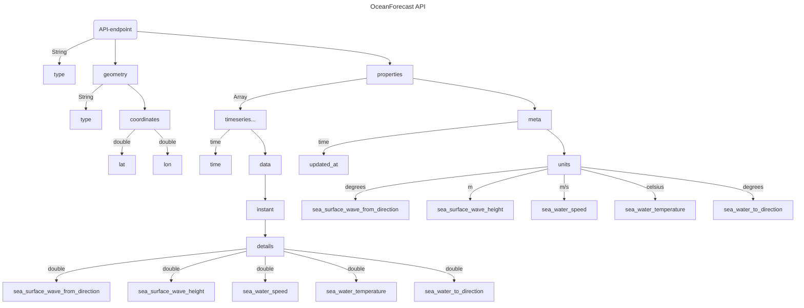

```mermaid
---
title: OceanForecast API
---
flowchart TB
    API(API-endpoint)


    API -->|String|type1[type]
    API --> geometry & properties

    geometry -->|String| type2[type]
    geometry --> coordinates
    
    coordinates -->|double| lat & lon

    properties --> meta
    properties -->|Array| timeseries...

    timeseries... -->|time| time
    timeseries... --> data

    data --> instant

    instant --> details

    details -->|double| d1[sea_surface_wave_from_direction]
    details -->|double| d2[sea_surface_wave_height]
    details -->|double| d3[sea_water_speed]
    details -->|double| d4[sea_water_temperature]
    details -->|double| d5[sea_water_to_direction]

    meta -->|time| updated_at
    meta --> units

    units -->|degrees| u1[sea_surface_wave_from_direction]
    units -->|m| u2[sea_surface_wave_height]
    units -->|m/s| u3[sea_water_speed]
    units -->|celsius| u4[sea_water_temperature]
    units -->|degrees| u5[sea_water_to_direction]


```