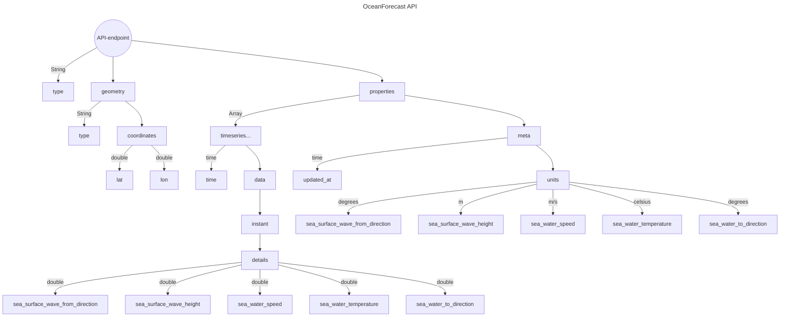

# Bruk av APIs

## OceanForecast API
En instans av OceanForecast API'et består av et område (geometry) og områdets målinger (properties) over tid (timeseries).

### Områder (Geometry)
Områdene har forskjellige typer (point, polygon, osv.), og har hver sine koordinater (longitude and latitude). I dette API'et er det hovedsaklig områder som er av typen "point". Ettersom kvaliteten av API'et ikke er perfekt, 1km+, vil den automatisk "snappe" seg til de nærmeste koordinatene den har data på. 
Noen eksempler kan være:
1. `https://api.met.no/weatherapi/oceanforecast/2.0/complete?lat=60.10&lon=5`
2. `https://api.met.no/weatherapi/oceanforecast/2.0/complete?lat=55.20&lon=2`

Her vil 1. "snappe" til lon: 5.0012 og lat: 60.1023 og 2. til lon: 2.0297 og lat: 55.2005. 
Det er også påkrevd å ha med lat og lon i api-kallet. Hvor denne grensen er, er jeg uusikker på men vises på kartet nedenfor:

 
Datamodellen finnes [her](https://docs.api.met.no/doc/oceanforecast/datamodel).

### Målinger (Propterties)
Målingene i en instans vil bestå av en meta som sier noe om hva slags type måleenheter som blir brukt.
| NAVN | MÅLEENHET | BESKRIVELSE |
|--------|--------|-------|
| sea_surface_wave_height | meter (m) | Significant wave height defined as the average of the highest one-third (33%) of waves (measured from trough to crest) |
| sea_surface_wave_from_direction | vinkel (degree) | Wave direction follows meteorological convention. It is given as the direction the waves are coming from (0° is north, 90° east, etc.) |
| sea_water_speed | fart (m/s) | Speed of sea water (current) |
| sea_water_to_direction | vinkel (degree) | Sea water (current) direction follows oceanographic convention. It is given as the direction the sea water is moving towards (0° is north, 90° east, etc.) |
| sea_water_temperature | temperatur (celcius) | Surface temperature of sea water |

### Flowchart of the API
