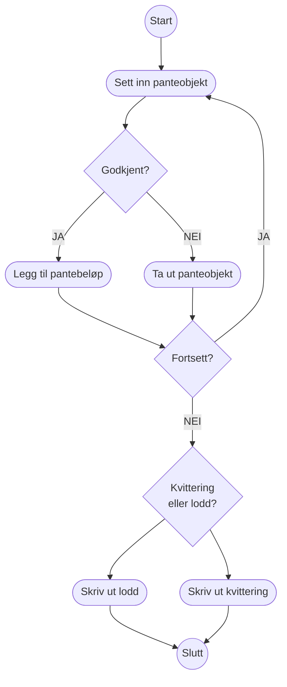

```mermaid
    flowchart TD;

        Start((Start))

        SettInn([Sett inn panteobjekt])
        TaUt([Ta ut panteobjekt])
        LeggTilBeløp([Legg til pantebeløp])
        SkrivUtLodd([Skriv ut lodd])
        SkrivUtKvittering([Skriv ut kvittering])


        godkjent{Godkjent?}
        fortsett{Fortsett?}
        ferdig{Kvittering \neller lodd?}

        Slutt((Slutt))

        Start --> SettInn

        SettInn --> godkjent

        godkjent --NEI--> TaUt

        godkjent --JA--> LeggTilBeløp

        LeggTilBeløp --> fortsett

        fortsett --JA--> SettInn

        TaUt --> fortsett

        fortsett --NEI--> ferdig

        ferdig --> SkrivUtLodd

        ferdig --> SkrivUtKvittering

        SkrivUtLodd --> Slutt

        SkrivUtKvittering --> Slutt

```