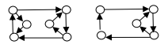
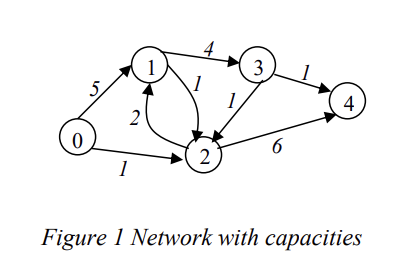

# Mandatory Assignment 2, IN3130

## Student Name:

The Java code for this assignment is located in `src/main/java/assignment`, and the test files can be found in `src/test/java/assignment`.
The Python code is in `src/python`

To run the JUnit tests, you have several options:
- Use IntelliJ (Community edition) or VS Code. If you're using IntelliJ, it should work out of the box. For VS Code, you'll need the Extension Pack for Java (recommended).
- Execute the command `gradle test`. Note that this requires Gradle to be installed, which isn't available on IFI machines.
- Download the JUnit jar and run it. However, this method is not recommended and hasn't been tested.

**Note:** 
Only the first option is compatible with IFI machines. Alternatively, you can run VS Code from the Horizon virtual machines.

# Information
- This assignment comprises three exercises. Each student must submit their own, independent solution for all exercises.
- A code skeleton is provided, the delivered work must be inside this folder and work with the provided tests.
- You should not modify any of the tests or the signatures, but you may add more functions or tests.
- Your code should be readable. Comments are necessary where the code isn't self-explanatory. Remember, 
comments shouldn't be used as an excuse for poorly written code. 
[Read more about best practices for writing code comments.](https://stackoverflow.blog/2021/12/23/best-practices-for-writing-code-comments/)
- Exercises 2 require textual answers. Provide these answers within this README.md file.
- If there are minor errors or ambiguities in the assignment text, you're expected to make **reasonable** assumptions.
- You have two attempts for this assignment. It's recommended to attempt all tasks in the first go, 
even if you encounter challenges with some. Note that even if your solution is correct, it might be not be accepted if it's not readable.
- The provided tests don't guarantee the correctness of your solution; they only check the output.
- If you need a 3-day extension, please submit your request via the [nettskjema](https://nettskjema.no/a/356842/) before the deadline.
- While English is the preferred language for code, you can also use Norwegian. However, consistency is key. For textual answers, both English and Norwegian are acceptable.
- You can embed images in the markdown for textual answers using the format: ``.
- Java 17 will be used for testing in java.
- You're allowed to create additional source files.

## Python
- Primarily designed for people who lack prior java knowledge, if you know java it's recommended to use java
- There might be slight differences between the text and the code as the assignment is designed for the java version
- Test can be executed with ```pytest``` after `````cd src/python`````
- Pycharm (community edition is free) allows for running the test py clicking the green play button left for a test
- You may alter the types in the precode or tests to use normal python or more numpy, numpy is generally recommended, but changes need to be documented in the README.md file and in the code as comments.


# Exercise 1 (A*-search)
The exercise is to write a program for solving the 8-puzzle and 15-puzzle; in general,
the (N\*N−1)-puzzle (on an N\×N-board). Your program must be made for an N×N board and not hardcode the dimensions. 

like this:

| 1 | 2 | 3 |
|---|---|---|
| 0 | 4 | 5 |
| 7 | 8 | 6 |

Here 0 indicates the empty square. The program should find a way of moving the tiles
(a sequence of legal moves) that ends up in the final state:

| 1 | 2 | 3 |
|---|---|---|
| 4 | 5 | 6 |
| 7 | 8 | 0 |

(and similar for NxN-boards). A legal move is to let the empty square “switch place”
with one of the (maximally 4) neighbouring tiles. Such a move can be described by
how the empty square is “moved”, with either L, R, U, D (left, right, up, down).
Note that the solution you give as an answer must be optimal, in the sense that no
solution with fewer moves should exist. Thus, the solution to the problem above
would be RRD.

Your program must use the A*-algorithm. It is OK to use a straightforward
Manhattan-heuristic, but you are welcome to try other monotone heuristics if you
want to.

NB: Your program must be able to solve all instances of the 8-puzzle (3×3 board)
within reasonable time. (This means using a monotone heuristic, and using efficient datastructures to 
speed up the algorithm (Implementation tips))

## Implementation tips
The states must be represented in some way. The easiest is to use 
a two-dimensional int array (and maybe in addition two integers saying
where the empty square is, which might speed up the algorithm).
A*-search requires several quite advanced data structures: You will at least need some
kind of priority queue, and some efficient way of looking up already visited nodes
(e.g., a hashmap).


## Exercise 2 (NP-completeness)
Let HC (Hamiltonian-cycle) = {< G > | The directed graph G contains a Hamiltonian cycle}.

We define it in such a way that graphs with only one vertex, and graphs with two
vertices connected to each other, are YES-instances of HC.

The problem HC is known to be NP-complete.

Prove that 2CC (2-Cycle-cover), defined below, is NP-complete.

Describe the reduction function f, and prove that it is correct. Argue that the reduction
is polynomial.

2CC <br/>
Input: A directed graph G. <br/>
Question: Are there two directed, simple, non-overlapping cycles in the graph,
each with at least three vertices, that together include all the vertices of
G? A cycle is simple if it never visits a vertex more than once.

Example
The following graphs show a YES-instance and a NO-instance of
2CC, respectively: 



### Answer 2
"fill in"

# Exercise 3 (Network flow)
The exercise is to implement the FordFulkerson-algorithm, using the shortest augmentation path in each step
(Edmonds and Karp’s version) (BFS). Given a graph with capacities your program shall output the value of an 
optimal flow, the flow over each edge, and a cut (the one given by the algorithm) proving that the flow is optimal.

The graph is a directed graph, i.e. the capacity from vertex u to vertex v can be
different from the capacity from v back to u. All capacities are integer and non-negative. 
(The term vertex is sometimes also called a node.)

The class takes in a 2d array as input. You should do any conversion here to the state you want to solve it in

The solve function will alter the internal state of the class and return the max flow

The cut function will return the cut
  
| 0 | 5 | 1 | 0 | 0 |
|---|---|---|---|---|
| 0 | 0 | 1 | 4 | 0 |
| 0 | 2 | 0 | 0 | 6 |
| 0 | 0 | 1 | 0 | 1 |
| 0 | 0 | 0 | 0 | 0 |

  Max Flow: 4
  Cut: 0 1 3

| 0 | 3 | 1 | 0 | 0 |
|---|---|---|---|---|
| 0 | 0 | 1 | 2 | 0 |
| 0 | 0 | 0 | 0 | 3 |
| 0 | 0 | 1 | 0 | 1 |
| 0 | 0 | 0 | 0 | 0 |



The figure above shows the network of the example input, with capacities on the edges.
(Vertex 0 is source, and 4 the sink.)

Implementation tips

- There is multiple ways of solving this problem. You can represent the nodes as
objects and treat it as a graph.
- You can also use multiple 2d arrays, or another data
structure. Thus, you could use three or four m ´ m-arrays. For instance, one for the
original problem N, one for the flow in this step f , and one for the possible flow
changes N(f ). It might also be convenient with a Boolean array that says whether a
vertex has been seen in the current search. 
- To obtain the Edmonds and Karp’s version
(with as few edges as possible) you must use a breath-first search. (requirement)

# Delivery Checklist
- Ensure your name is at the top of the README file.
- Make a copy of the `Oblig2` folder. In the copied folder, remove the following folders if they exist:
`build`, `bin`, `.idea`, and `.gradle` (note the gradle folder **with** a "." at the start) or any other generated folder or file.
- Zip the copied `Oblig2` folder (it should still be named `Oblig2`). 
Concatenate your username with "Oblig2" to name the zip file (e.g., `usernameOblig2.zip`).
- Upload to Devilry before the deadline. Multiple submissions are allowed; however, only the latest submission will be evaluated.
