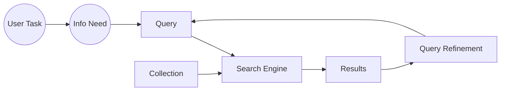

# Information Retrieval
**Finding material of an unstructured nature that satisfies an _information need_ from within large collections.**

**Examples:**
- Web search
- E-mail search
- Corporate knowledge bases
- Legal information retrieval
- Searching your laptop

### Unstructured (plain text) vs. structured (database) data in the mid-nineties
There was a lot less unstructured data before; today, there is much more unstructured data compared to structured data.

### Basic assumption of Information Retrieval
**Collection**: A set of documents  
Goal: Retrieve documents with relevant information based on the user's _information needs_ for completing a task

### The classic search model

### Measurements
- **Precision**: Fraction of retrieved docs that are relevant to the user's _information need_
- **Recall**: Fraction of relevant docs in collection that are retrieved

### Term-document incidence matrices
Create a table where rows are all the unique words and the columns are the documents. The results are 1 if the document contains the word, else 0.

Too costly!

### Inverted Index
Store only the cells with a 1 in a dictionary structure where the keys are the unique words and the values are linked lists with the documentID. Sort the linked lists in increasing ID number (useful for merging later).

#### Inverted Index Construction

- **Tokenizer**: Converts the texts into keywords
- **Linguistic Modules**: Converts the tokens to more generalized/usable version of themselves
- **Indexer**: Creates the inverted index

#### Initial stages of text processing
- **Tokenization**: Cut character sequence into word tokens
- **Normalization**: Map text and query term to same form  
  - `U.S.A` turns to `usa`
  - `Friends` turns to `friend`
  - and so on...
- **Stemming**: Use one kind of the root forms of words  
  - Authorize - Authorization

- **Stop Words:** We may omit very common words (or not)
    - the, a, to, of

#### Indexer steps: token sequence
Put every word in each doc into a list and note their documentID. Then sort them in increasing order of documentID then sort them based on terms in alphabetical order.

## Query

### Query processing: `AND`
Retrive the linked lists from inverted index and "merge" them. Have a pointer-index for both for linked list x and y and then increase them based on which one is pointing at the smallest documentID. Terminate when one of the pointers are null (outside of their linked list).

### Boolean queries: Exact match
The **Boolean retrival model** is being able to ask a query that is a boolean expression:
- **Boolean Queries**: queries using AND, OR and NOT to join query terms

### Query optimization
Start merging the terms with the smallest sets to keep the result list as small as possible (hence the length attribute in the reversed index structure).

## Phrase queries
Able to answer queries like "stanford university" - as a phrase.

More understood or easier to use by the user.

No longer suffices to store in `<term : docs>` format

### Biword indexes
Use the same strategy but store the words in pairs.
- "Friends, Romans, Countrymen" --> "friends romans" & "romans countrymen"

### Longer phrase queries
Phrases can be processed by breaking them down to a boolean query:
- "stanford university palo alto" --> "stanford university" AND "university palo" AND "palo alto"

#### Issues for biword indexes
- Can create false, positives since it doesn't guarante that the phrase is intact
- Index blowup due to bigger dictionary

### Positional indexes
Store the position of the term inside of the postings.

Match the order of the phrase with the positions in the postings.

Storing the positions requires a lot more space.

#### Rules of thumb
- A positional index is 2-4 times as large as a non-positional index.
- Positional index size 35-50% of volume of original text
- Holds for "English-like" languages

### Proximity queries
Queries that contains arguments with within of so and so many words. LIMIT! /3 STATUE /3 FEDERAL /2 TORT

### Structured data
Tends to refer to information in "tables"

### Unstructured data
Typically refers to free text and it allows for more "conecept" based queries

### Semi-structured data
New terms like:
- **Title**: contains <u>data</u>
- **Bullets**: contains <u>search</u>

????