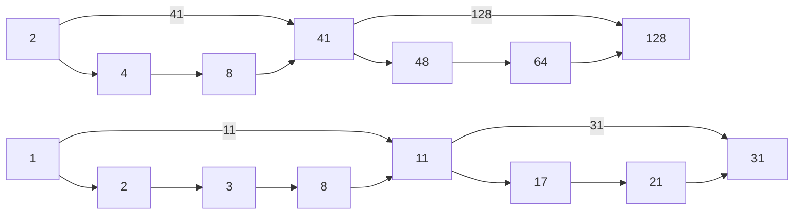

# Infromation Retrieval

### Parsing a document
- What format? Format can be in pdf, word, excel, html, ...
- What language? Japanese, Norwegian, German
- What character set is in use? CP1552, UTF-8, ...
- Done with heuristics

#### Format/Language
- Documents can contain info in multiple languages

#### What is a document?
- A file?
- An email? How many attatchments
- A group of files? PPT, LaTeX split over HTML pages

### Tokenization
- A **token** is an instance of a sequence of charaters
- What is valid to emit?

#### Issues
- Findland's capital --> Finland AND s? Finlands? Finland's
- Hewlett-Packard --> Hewlett AND Packard
- And so on...
- Numbers are also difficult
    - dates
    - year
    - phone numbers
    - ...
- Languages has different formats
    - German has complicated words without spaces
    - French has a lot of '' signs
    - Japanese has a lot of different alphabets
    - Arabic goes right to left instead of the standard left to right

#### Stop words
- the, a, and, to, be, ...
- 30% of postings for top 30 words
- If we were to store all the postings for the word "the" then we would pretty much store all of the postings. This can be handled in a better way... for later...

### Normilization
- Want to parse words like U.S.A to USA for example
- Want to define a equivilant class
- What are the user actually searching for?
    - Did they mean the short version of another word or the word itself?
- Different languages
- MIT is a shortening while mit in german is a actual word

#### Case folding
- Make every word to lowercase
- Should we make exceptions?
- We should lowercase everything since users tends to lowercase it anyways

#### Normalization to terms
- Asymmetric expansion
- When entering window, the search might be window OR windows OR Window
- Might be better, but less effecient

#### Thesauri and soundex
- terms that are very alike like car and automobile can be combined
    - expand the query
- spelling mistakes are handled by equibalence classes based on phonetic heuristics

### Lemmatization
- Reduce what we store and what we search for by mapping variants to a common variant
    - am, are, is --> be
    - car, cars, car's, cars' --> car

### Stemming
- Reduce terms to their "roots" before indexing
- Done with a algorithm
    - Language based

#### Porter's algorithm
- everything ending in sses --> ss
- ies --> i
- ational --> ate
- tional --> tion

- weight of word sensitive rules
- (m>1) EMENT -->
    - replacement --> replac
    - cement --> cement

#### Language specificity
- Lemmatization and Stemming are language and application specific
- These are "plug-in"s
- There are open source options

#### Does it help?
- It helps depends on the language
    - If the langage is more complicated the more it helps

### Merging
- add skip pointers to skip steps in the merging so we dont have to check every document
- Where do we place these skip pointers?
    - Should the first one point to the last one? Very rare occation but is effecient when it happens
    - Should it be minimal?
    - Place it for every square root of the frequency of the word

### Permutations
- hello
    - hello$
    - ello$h
    - llo$he
    - lo$hel
    - o$hell
- Generate all rotations for all terms to produce the permuterm vocaublary
- X --> X$
- X* --> $X*
- *X --> X$\*
- X*Y --> Y$X\*
- X*Y\*Z --> Z$X\* and Y\*
- `fi*er --> er$fi* --> {fishmonger, filibuster, ...}`

#### Data structures
- some data structures are more "prefix-friendly" than others
- Trees
    - Red-black trees
    - R-trees
    - ...
    - Often friendly
    - Tries
        - Trees made of chars and strings creating a tree of words branching down letter by letter
        - Allows words to share letters and therefor saves memory
        - Is an array with a tree structure
        - In addition to share prefix, we can also share postfixes
- Hashmaps are not often friendly
- Sorted arrays allows for binary search, O(log(n))

- Burrows-Wheeler Transform
    - Not that important, but is relevant for another implemenation for a later assignment (b?)

- Suffix arrays
    - store all the suffixes in a array and sort them lexographically
    - this create an array of indexes that is connected to the offeset possision of the suffix
    -

- Tries and edit tables
    - Handles spelling errors
    - Edit tables
        - The smallest number of edit operations needed to rewrite one string into another
        - Edit operations
            - Insert
            - Delete
            - Replace
            - Transpose, swapping two letters, still counts as 1 edit operation
                - This requires looking at the cell at coordinates (i-2,j-2) for transposing
    - Tries
        - Search the tree with a edit threshold
    - Reuse the edit table if the prefix is similar
        - Bring the table in a search through the trie
    
    - The AHO-Corasick algorithm
        - efficiently find all strings in a given buffer that also appear in a huge dictionary
        - the dictionary are represented as a trie
        - "trie-walk"
        - 
