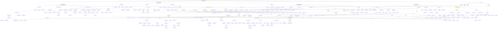

```mermaid
graph TB
    BD[Big Data Systems]
    
    %% Main Categories
    BD --> DSP[Data Stream Processing]
    BD --> DDB[Distributed Databases]
    BD --> DW[Data Warehousing]
    BD --> WEB[Web Data Management]
    BD --> CLOUD[Cloud & Scalable Systems]
    BD --> ML[Machine Learning Integration]
    
    %% Data Stream Processing Branch
    DSP --> DSP_CORE[Core Concepts]
    DSP_CORE --> STREAM[Data Streams]
    DSP_CORE --> OPS[Operators]
    DSP_CORE --> METRICS[Performance Metrics]
    
    STREAM --> |"bounded by"| WINDOWS[Windows]
    WINDOWS --> TUMBLING[Tumbling]
    WINDOWS --> SLIDING[Sliding]
    WINDOWS --> SESSION[Session]
    
    OPS --> BLOCKING[Blocking Operators]
    OPS --> NONBLOCK[Non-blocking Operators]
    BLOCKING --> |"require"| STATE[State Management]
    NONBLOCK --> |"process immediately"| LOWLAT[Low Latency]
    
    STATE --> OPSTATE[Operator State]
    STATE --> KEYSTATE[Keyed State]
    STATE --> |"stored in"| BACKEND[State Backends]
    BACKEND --> MEMORY[In-Memory/JVM]
    BACKEND --> DISK[RocksDB/Disk]
    
    METRICS --> LATENCY[Latency]
    METRICS --> THROUGHPUT[Throughput]
    LATENCY --> |"measured by"| PROCTIME[Processing Time]
    THROUGHPUT --> |"limited by"| LOADSHED[Load Shedding]
    
    DSP --> TIME[Time Management]
    TIME --> EVENTTIME[Event Time]
    TIME --> PROCESSTIME[Processing Time]
    TIME --> |"managed via"| WATERMARK[Watermarks]
    WATERMARK --> |"handles"| OUTORDER[Out-of-order Events]
    
    DSP --> GUARANTEE[Processing Guarantees]
    GUARANTEE --> ATMOST[At-most-once]
    GUARANTEE --> ATLEAST[At-least-once]
    GUARANTEE --> EXACTLY[Exactly-once]
    EXACTLY --> |"requires"| CHECKPOINT[Checkpoints]
    CHECKPOINT --> |"uses"| CHANDY[Chandy-Lamport Algorithm]
    CHECKPOINT --> |"user-triggered"| SAVEPOINT[Savepoints]
    
    LOADSHED --> |"decides"| QOS[Quality of Service]
    QOS --> SEMANTIC[Semantic Dropping]
    QOS --> RANDOM[Random Dropping]
    
    %% Distributed Database Branch
    DDB --> DDB_ARCH[Architecture Types]
    DDB_ARCH --> CLIENTSERVER[Client/Server]
    DDB_ARCH --> P2P[Peer-to-Peer]
    DDB_ARCH --> MDBS[Multi-DBMS]
    
    DDB --> DISTRIB[Data Distribution]
    DISTRIB --> HFRAG[Horizontal Fragmentation]
    DISTRIB --> VFRAG[Vertical Fragmentation]
    DISTRIB --> HYBRID[Hybrid Fragmentation]
    DISTRIB --> REPL[Replication]
    
    HFRAG --> |"distributes"| ROWS[Rows/Tuples]
    VFRAG --> |"distributes"| COLS[Columns/Attributes]
    REPL --> |"creates"| COPIES[Multiple Copies]
    COPIES --> |"requires"| CONSISTENCY[Consistency Management]
    
    DDB --> TRANS[Transaction Management]
    TRANS --> CC[Concurrency Control]
    TRANS --> COMMIT[Commit Protocols]
    TRANS --> RECOVERY[Recovery Protocols]
    
    CC --> TPL[2-Phase Locking]
    CC --> TSO[Timestamp Ordering]
    CC --> |"prevents"| DEADLOCK[Deadlock]
    
    COMMIT --> TPC[2-Phase Commit]
    COMMIT --> THREEPC[3-Phase Commit]
    TPC --> |"ensures"| ATOMICITY[Atomicity]
    
    CONSISTENCY --> |"constrained by"| CAP[CAP Theorem]
    CAP --> CAPCONS[Consistency]
    CAP --> AVAIL[Availability]
    CAP --> PARTITION[Partition Tolerance]
    CAP --> |"choose 2 of 3"| TRADEOFF[Trade-offs]
    
    TRADEOFF --> STRONG[Strong Consistency]
    TRADEOFF --> EVENTUAL[Eventual Consistency]
    STRONG --> |"used in"| ACID[ACID Systems]
    EVENTUAL --> |"used in"| BASE[BASE Systems]
    
    DDB --> QUERY[Query Processing]
    QUERY --> DECOMP[Query Decomposition]
    QUERY --> LOCAL[Query Localization]
    QUERY --> OPTIM[Query Optimization]
    OPTIM --> |"minimizes"| DATATRANS[Data Transfer Cost]
    
    %% Multi-Database Systems
    MDBS --> SCHEMA[Schema Integration]
    SCHEMA --> MATCH[Schema Matching]
    SCHEMA --> INTEGRATE[Schema Integration]
    SCHEMA --> MAP[Schema Mapping]
    
    MATCH --> |"resolves"| CONFLICTS[Schema Conflicts]
    CONFLICTS --> NAMECONF[Name Conflicts]
    CONFLICTS --> STRUCTCONF[Structure Conflicts]
    CONFLICTS --> DATACONF[Data Representation Conflicts]
    
    MDBS --> MEDWRAP[Mediator/Wrapper Architecture]
    MEDWRAP --> MEDIATOR[Mediator Layer]
    MEDWRAP --> WRAPPER[Wrapper Components]
    MEDIATOR --> |"coordinates"| GLOBALSCHEMA[Global Schema]
    WRAPPER --> |"translates to"| LOCALSCHEMA[Local Schema]
    
    %% Data Warehousing Branch
    DW --> DWCHAR[DW Characteristics]
    DWCHAR --> SUBJECT[Subject-oriented]
    DWCHAR --> INTEGRATED[Integrated]
    DWCHAR --> NONVOL[Non-volatile]
    DWCHAR --> TIMEVAR[Time-variant]
    
    DW --> SCHEMAS[Schema Designs]
    SCHEMAS --> STAR[Star Schema]
    SCHEMAS --> SNOWFLAKE[Snowflake Schema]
    SCHEMAS --> CONSTELLATION[Constellation Schema]
    
    STAR --> FACT[Fact Table]
    STAR --> DIM[Dimension Tables]
    FACT --> |"stores"| MEASURES[Measures/Metrics]
    DIM --> |"provides"| CONTEXT[Context/Attributes]
    
    DW --> ETL[ETL Process]
    ETL --> EXTRACT[Extract]
    ETL --> TRANSFORM[Transform]
    ETL --> LOAD[Load]
    TRANSFORM --> |"includes"| CLEAN[Data Cleaning]
    TRANSFORM --> |"includes"| FORMAT[Data Formatting]
    
    DW --> OLAP[OLAP Operations]
    OLAP --> ROLLUP[Roll-up]
    OLAP --> DRILLDOWN[Drill-down]
    OLAP --> SLICE[Slice]
    OLAP --> DICE[Dice]
    OLAP --> PIVOT[Pivot]
    
    ROLLUP --> |"aggregates to"| HIGHER[Higher Level]
    DRILLDOWN --> |"disaggregates to"| LOWER[Lower Detail]
    
    DW --> |"contrasts with"| OLTP[OLTP Systems]
    OLTP --> |"optimizes"| THROUGHPUT_TRANS[Transaction Throughput]
    OLAP --> |"optimizes"| RESPONSE[Query Response Time]
    
    DW --> DATAMART[Data Marts]
    DATAMART --> |"specialized subset of"| DW
    
    %% Web Data Management Branch
    WEB --> WEBCHAR[Web Characteristics]
    WEBCHAR --> SEMISTRUC[Semi-structured]
    WEBCHAR --> VOLATILE[Volatile]
    WEBCHAR --> SCALE[Massive Scale]
    WEBCHAR --> DEEPWEB[Deep Web]
    
    WEB --> WEBSEARCH[Web Search]
    WEBSEARCH --> CRAWLER[Web Crawlers]
    WEBSEARCH --> INDEX[Indexing]
    WEBSEARCH --> RANK[Ranking]
    
    CRAWLER --> INCREMENTAL[Incremental Crawling]
    CRAWLER --> FOCUSED[Focused Crawling]
    CRAWLER --> PARALLEL[Parallel Crawling]
    
    INDEX --> INVERTED[Inverted Index]
    RANK --> PAGERANK[PageRank]
    RANK --> HITS[HITS Algorithm]
    
    WEB --> XML[XML Technologies]
    XML --> XMLDOC[XML Documents]
    XML --> XMLSCHEMA[XML Schema/DTD]
    XML --> XPATH[XPath]
    XML --> XQUERY[XQuery]
    
    XML --> |"foundation for"| SEMWEB[Semantic Web]
    SEMWEB --> RDF[RDF Triples]
    SEMWEB --> ONTO[Ontologies]
    SEMWEB --> LOD[Linked Open Data]
    
    RDF --> |"subject,predicate,object"| TRIPLE[Triple Structure]
    RDF --> |"queried via"| SPARQL[SPARQL]
    
    WEB --> WEBQUERY[Web Querying]
    WEBQUERY --> KEYWORD[Keyword-based]
    WEBQUERY --> SEMIQUERY[Semi-structured Querying]
    WEBQUERY --> QA[Question-Answering]
    
    %% Cloud & Scalable Systems Branch
    CLOUD --> CLOUDSERV[Cloud Services]
    CLOUDSERV --> IAAS[IaaS]
    CLOUDSERV --> PAAS[PaaS]
    CLOUDSERV --> SAAS[SaaS]
    CLOUDSERV --> DAAS[DaaS]
    
    CLOUD --> SCALING[Scaling Strategies]
    SCALING --> SCALEOUT[Scale-out/Horizontal]
    SCALING --> SCALEUP[Scale-up/Vertical]
    SCALEOUT --> |"adds"| NODES[More Nodes]
    SCALEUP --> |"increases"| CAPACITY[Node Capacity]
    
    CLOUD --> NOSQL[NoSQL Systems]
    NOSQL --> |"trades"| ACIDPROP[ACID Properties]
    NOSQL --> |"for"| SCALABILITY[Scalability]
    
    NOSQL --> KV[Key-Value Stores]
    NOSQL --> DOC[Document Stores]
    NOSQL --> TAB[Tabular Stores]
    NOSQL --> GRAPH[Graph Databases]
    
    KV --> DYNAMO[DynamoDB]
    KV --> CASSANDRA[Cassandra]
    DOC --> MONGO[MongoDB]
    DOC --> COUCH[CouchDB]
    TAB --> BIGTABLE[BigTable]
    TAB --> HBASE[HBase]
    GRAPH --> NEO4J[Neo4J]
    
    CLOUD --> NEWSQL[NewSQL]
    NEWSQL --> |"combines"| SQLCONS[SQL + Consistency]
    NEWSQL --> |"with"| NOSQLSCALE[NoSQL Scalability]
    NEWSQL --> F1[Google F1/Spanner]
    NEWSQL --> COCKROACH[CockroachDB]
    NEWSQL --> VOLT[VoltDB]
    
    CLOUD --> POLY[Polystores/Multistores]
    POLY --> LOOSE[Loosely-coupled]
    POLY --> TIGHT[Tightly-coupled]
    POLY --> HYBRIDPOLY[Hybrid]
    
    LOOSE --> |"uses"| MEDWRAP
    TIGHT --> |"uses"| UNIFIED[Unified Query Language]
    
    CLOUD --> BIGDATA[Big Data Processing]
    BIGDATA --> MAPREDUCE[MapReduce]
    BIGDATA --> SPARK[Apache Spark]
    BIGDATA --> HADOOP[Hadoop Ecosystem]
    
    HADOOP --> HDFS[HDFS]
    HADOOP --> YARN[YARN]
    HADOOP --> HIVE[Hive]
    
    MAPREDUCE --> |"pattern for"| BATCH[Batch Processing]
    SPARK --> |"supports"| STREAMING[Stream Processing]
    DSP --> |"implemented in"| FLINK[Apache Flink]
    FLINK --> |"alternative to"| SPARK
    
    CLOUD --> DATALAKE[Data Lakes]
    DATALAKE --> |"uses"| SCHEMAREAD[Schema-on-read]
    DW --> |"uses"| SCHEMAWRITE[Schema-on-write]
    DATALAKE --> |"stores"| RAW[Raw Data]
    DW --> |"stores"| PROCESSED[Processed Data]
    
    %% Machine Learning Integration Branch
    ML --> MLPIPE[ML Pipeline]
    MLPIPE --> PREML[Pre-ML/Data Preparation]
    MLPIPE --> INML[In-ML/Training]
    MLPIPE --> POSTML[Post-ML/Management]
    
    PREML --> DISCOVER[Data Discovery]
    PREML --> CLEANING[Data Cleaning]
    PREML --> LABEL[Data Labeling]
    
    CLEANING --> |"uses"| DW
    CLEANING --> |"handles"| QUALITY[Data Quality]
    QUALITY --> VERACITY[Veracity]
    QUALITY --> MISSING[Missing Values]
    QUALITY --> OUTLIERS[Outliers]
    
    LABEL --> CROWD[Crowdsourcing]
    LABEL --> ACTIVE[Active Learning]
    LABEL --> WEAK[Weak Supervision]
    
    INML --> FEATURE[Feature Extraction]
    INML --> MODELSEL[Model Selection]
    INML --> ACCEL[Acceleration]
    
    FEATURE --> |"benefits from"| MATERIAL[Materialization]
    ACCEL --> |"uses"| PARALLEL_ML[Parallelism]
    
    POSTML --> STORAGE[Model Storage]
    POSTML --> VERSION[Versioning]
    POSTML --> DEPLOY[Deployment]
    POSTML --> DEBUG[Debugging]
    
    STORAGE --> |"uses"| COMPRESS[Compression]
    STORAGE --> |"uses"| INDEXML[Indexing]
    
    ML --> MLTYPE[ML Types]
    MLTYPE --> SUPER[Supervised Learning]
    MLTYPE --> UNSUPER[Unsupervised Learning]
    
    SUPER --> CLASS[Classification]
    SUPER --> PRED[Prediction]
    UNSUPER --> CLUSTER[Clustering]
    UNSUPER --> ASSOC[Association]
    
    %% Cross-cutting Concerns
    BD --> CONCERNS[Cross-cutting Concerns]
    CONCERNS --> PERF[Performance]
    CONCERNS --> FAULT[Fault Tolerance]
    CONCERNS --> SEC[Security & Privacy]
    CONCERNS --> DATAQUAL[Data Quality]
    
    PERF --> |"measured by"| LATENCY
    PERF --> |"measured by"| THROUGHPUT
    PERF --> |"improved via"| PARALLEL_GEN[Parallelization]
    
    PARALLEL_GEN --> PIPELINE[Pipeline Parallelism]
    PARALLEL_GEN --> DATAPAR[Data Parallelism]
    PARALLEL_GEN --> TASKPAR[Task Parallelism]
    
    FAULT --> |"addressed via"| CHECKPOINT
    FAULT --> |"addressed via"| REPL
    FAULT --> |"addressed via"| RECOVERY
    
    SEC --> ENCRYPT[Encryption]
    SEC --> ACCESS[Access Control]
    SEC --> PRIVACY[Privacy Preservation]
    
    PRIVACY --> GDPR[GDPR Compliance]
    PRIVACY --> DIFFPRIV[Differential Privacy]
    PRIVACY --> ANON[Anonymization]
    
    DATAQUAL --> PROFILE[Data Profiling]
    DATAQUAL --> VALID[Data Validation]
    DATAQUAL --> ENRICH[Data Enrichment]
    
    %% Big Data Characteristics
    BD --> FIVEV[Five V's]
    FIVEV --> VOLUME[Volume]
    FIVEV --> VARIETY[Variety]
    FIVEV --> VELOCITY[Velocity]
    FIVEV --> VERAC[Veracity]
    FIVEV --> VALUE[Value]
    
    VOLUME --> |"requires"| DISTRIB
    VARIETY --> |"handled by"| NOSQL
    VELOCITY --> |"addressed by"| DSP
    VERAC --> |"improved by"| CLEANING
    VALUE --> |"extracted via"| ML
    
    %% Query Optimization
    QUERY --> COST[Cost-based Optimization]
    QUERY --> HEURISTIC[Heuristic Optimization]
    QUERY --> ADAPTIVE[Adaptive Optimization]
    
    COST --> |"uses"| STATS[Statistics]
    COST --> |"estimates"| CARD[Cardinality]
    COST --> |"estimates"| SELECT[Selectivity]
    
    STATS --> HIST[Histograms]
    STATS --> SAMPLE[Sampling]
    STATS --> SKETCH_STAT[Sketches]
    
    %% Indexing
    INDEX --> BTREE[B-tree Index]
    INDEX --> HASH[Hash Index]
    INDEX --> BITMAP[Bitmap Index]
    
    BTREE --> |"supports"| RANGE[Range Queries]
    HASH --> |"supports"| EQUAL[Equality Lookups]
    BITMAP --> |"efficient for"| LOWCARD[Low Cardinality]
    
    %% Join Algorithms
    QUERY --> JOIN[Join Algorithms]
    JOIN --> NESTED[Nested Loop Join]
    JOIN --> HASHJOIN[Hash Join]
    JOIN --> MERGE[Merge Join]
    
    QUERY --> |"in distributed systems"| DISTJOIN[Distributed Joins]
    DISTJOIN --> BROADCAST[Broadcast Join]
    DISTJOIN --> SHUFFLE[Shuffle Join]
    
    %% Storage
    BACKEND --> COLSTORE[Column Store]
    BACKEND --> ROWSTORE[Row Store]
    
    COLSTORE --> |"efficient for"| ANALYTICS[Analytics Workloads]
    ROWSTORE --> |"efficient for"| TRANSACT[Transactional Workloads]
    
    COLSTORE --> PARQUET[Parquet Format]
    COLSTORE --> ORC[ORC Format]
    
    %% Operator Migration (Advanced DSP)
    STATE --> MIGRATION[Operator Migration]
    MIGRATION --> LAZY[Lazy Migration]
    LAZY --> |"transfers state"| JUSTINTIME[Just-in-time]
    LAZY --> LATMODE[Latency Mode]
    LAZY --> UTILMODE[Utility Mode]
    
    LATMODE --> |"prioritizes"| TIMING[Timely Delivery]
    UTILMODE --> |"prioritizes"| ESSENTIAL[Essential Data]
    
    style BD fill:#e1f5ff,stroke:#01579b,stroke-width:4px
    style DSP fill:#fff3e0,stroke:#e65100,stroke-width:3px
    style DDB fill:#f3e5f5,stroke:#4a148c,stroke-width:3px
    style DW fill:#e8f5e9,stroke:#1b5e20,stroke-width:3px
    style WEB fill:#fce4ec,stroke:#880e4f,stroke-width:3px
    style CLOUD fill:#e0f2f1,stroke:#004d40,stroke-width:3px
    style ML fill:#fff9c4,stroke:#f57f17,stroke-width:3px
    style CAP fill:#ffebee,stroke:#b71c1c,stroke-width:2px
    style CONCERNS fill:#efebe9,stroke:#3e2723,stroke-width:2px
```