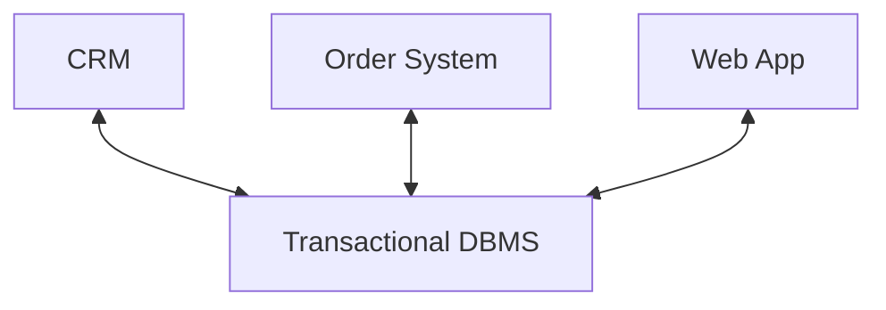
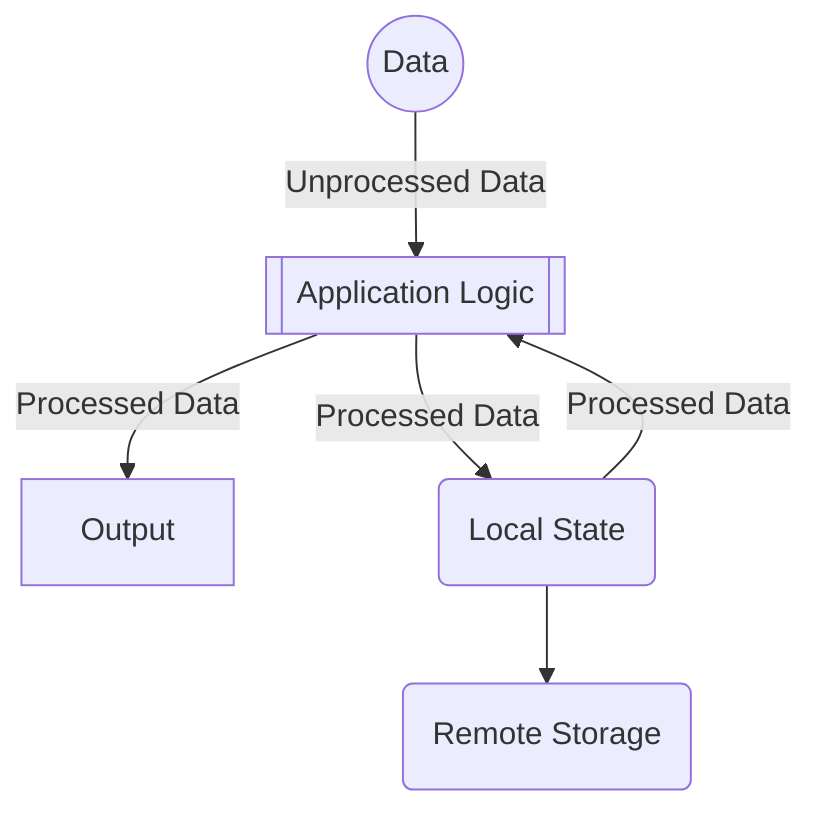

# Introduction to Stream Processing

## Big Data - Defining Challenges
[Beckman Report 2016]
- Distribution
- Integration
- Heterogeneity
- In-memory processing
    - Storing the data
- Large-scale systems
- Data analysis
    - Required because we need to analyse to better know how to manage it

## Big Data - Main Characteristics
- Volume
    - Too much data, it cannot fit in a single system
- Variety
    - Some data is structured or unstructured
- Velocity
    - How fast is the data incoming, some might be in real-time
    - Stream processing is important for this reason
    - Cannot afford to store it then process it
- Value
    - What is the meaning of the data?
    - How should it be used?
    - The data is as good as I how well i can analyze it
- Veracity
    - Can the data be trusted?
    - How much do trust the data, what is the accuracy?
    - The source of the data is important

## Big Data - 5 Related Challanges
- Scalable big/fast
    - Need to expand, there is too much data
    - Cost-effecient storage
    - Late-bound schemas, we dont have time to make a schema for it now
    - Store it raw, be able to handle raw data
    - Need to have some form of metric
- Coping with the diversity in the data management
    - There is not a one solution fits all
    - The data processing workflows are also diverse
- End-to-end data-to-knowledge pipeline
    - Need open source solutions to have a standard everyone can work with so storages can cooperate in a efficient way
    - Need to understand the data
- Cloud services
    - Too much data, we cannot escape cloud solutions
    - IaaS - PaaS - SaaS 
    - Elasticity (SLA), you get what you pay for
    - Harder to controll the dataflow of the data you're storing
    - Data sharing is important and useful, but also important keep private data private
- People have new roles
    - Humans produce a lot of data and consume it
    - A person is not interested in absolutely all data, skim it down to whats relevant

## New Challenges [Seattle Report 2022]
- Missed the AI/ML trend
- The 5 related challenges are still relevant, but have to change/adapt to ML/AI

- There is more personal data and more use of personal data
- Ethics and fair use of data is more relevant
- Changes in hardware affects the data managing systems

- Concerns around that DBS community is moving too slow while others move quickly

## DBS and Data Science?
**Data Science**: combines data clearning and transofmation, statistical analysis, data visualization and ML techniques
- Data Science [NSF CISE 2017]: "the processes and systems that enable the extraction of knowledge or insight from data in various forms, either stuctured or unstructured"

**DBS technology**: plays a major role in **Data Science**: pipeline from raw input data to insight that requires use of data cleaning and transformation, data analytic techniques, and data visualization
- Clean the data
- Handle edge cases

## Data Governance
- GDPR, auditing
- Ethical data science -> responsible data management
- EU acts, how to use AI to handle data
- Cannot avoid AI, it is too useful

## Database Engines
- Handles:
    - Heterogeneous computing
    - Distributed transactions
    - Data lakes
    - Approximation in query answering
    - ML workloads
    - ML for reimaging data platform components
    - Benchmarking and reproducability
        - Can you reproduce results

## DB Research - New Challenges [Cambridge Report 2025]
- Core Data Systems
    - Big Data everywhere, Cloud-based data systems, emerging new hardware, scalability, usability
    - Disaggregated storage and compute
    - Resource hungry AI, especially AI accelerators
- Human Centric Systems and Data Science
    - Data sharing and collaboration
    - Keep privacy across distributed datasets
    - Data governance, NL-based querying
    - Need to change syntax to be more human friendly
    - Need for extensible systems is more and more prominent
    - Open source is needed

- ML and AI for Data Systems
    - AI/ML everywhere -> generative AI, LLMs...
    - Its evolving very fast and Big Data Systems must catch up
    - Models for severless VM management, its here to stay and might be the next thing
    - High dimensional storage is used with AI
    - Responsible Data Management
        - Is it ok to use AI with the data being stored?
        - Integrating data management reasearch into responsible AI
        - Use AI to do complex decisions

## Data vs Information vs Knowledge
- **Data**: 
- **Information**: 
- **Knowledge**: 

**Real-time**: Gives a garuantee to have the data ready at a given time
- People use the term to say its supposed to be as fast as possible to be like its real-time

# Transactional Processing - Traditional 

Problem: When different systems share the same values there might occur synchronization issues

# Analystical Processing - Stateful Stream Processing

