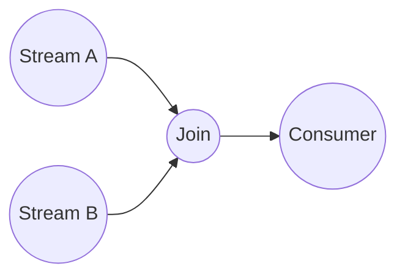

# Data stream processing
Source: Stream processing with Apache Flink, O ´Reilly 2019

## Motivation
- Large amounts of interesting data
- Cannot store it in a harddisk to later analyse it

### Data Stream Processing Applications
- Sensor networks
    - A lot of data from different sources, filtering, alarms, aggrication, joining streams
- Network traffic analysis
    - Real time data
- Financial tickers
- On-line actions
- Transactions log analysis, e.g., Web, telephone calls, ...
Credit card fraud detection

### Motivation for Data Stream Processing
- Increase in performance of disks
- Costly to have good quality storage

### Handling data streams in Data Base System
- Traditional Data Base System
    - Static disk, read and writes
    - Query processing communicates with the main memory and the main memory checks the static disk
    - Pull approach, go inn the disk and pulls out the data

- Data Stream Processing
    - On the fly data analysing
    - Data entering the system
    - Want to analyse each tuple of data or events that are entering
    - Conitnous queries
    - Push approach, go inn the disk/main memory and pushes analysed data

### DBS vs DSP
| Feature                  | **DBS (Database Systems)**   | **DSP (Data Stream Processing)**       |
| ------------------------ | ---------------------------- | -------------------------------------- |
| **Data Nature**          | Persistent, stored data      | Transient, streaming data              |
| **Access Pattern**       | Random access to stored data | Sequential processing of incoming data |
| **Query Type**           | One-time queries             | Continuous queries (CQs)               |
| **Memory Use**           | Unbounded disk storage       | Bounded main memory                    |
| **Real-Time Capability** | Not real-time                | Real-time or near-real-time            |
| **Update Rate**          | Low                          | High (possibly GB/sec)                 |
| **Data Granularity**     | Any (coarse or fine)         | Fine-grained, detailed events          |
| **Data Accuracy**        | Assumes precise data         | Accepts imprecise or delayed data      |
| **Transaction Support**  | Yes (ACID properties)        | No transaction management              |

- A lot of trade offs

## Historical development
### Data Stream Management Systems vs Complex Event Processing
- There is a mix, hard to distinguish the different types in the systems

### The evolution
- 1. generation
    - Continiuous queries
    - Inverted DBs
    - How can we model the data in a stream
    - Sliding windows, blocking operators
    - Not enough resources
- 2. generation
    - Map Reduce
    - Scalability
    - Best-effirt processing
    - Out-of-order management
    - State management
    - Proc. Guarantees
    - Reconfiguration
    - Stream SQL
    - How to handle parrallellism, should be fast and quick
- 3. generation
    - Cloud Apps
    - Serverless
    - Actors
    - Transactions
    - HW Accel.
    - Edge Nodes
    - Full SQL
    - State queries

## Fundamentals
- Data stream: Unbounded sequence of tuples/events/records generated continuously over time
- Data touple: ordered list of attribute-value pair including a time stamp

t = (symbol, AAPL), (price, 150.23), (time, 2022-02-14 10:30:00)

### Latency
- How long does it take to process a tuple/event?
- t_latency = t_output - t_input
- Moder nsystems has a few ms in latency
- Batch processing requires a ll tuples before processing starts

### Throughput
- Capacity of the system
- Number of events per unit of time


### Query
- A function that processes a data stream and returns a result
- SELECT A.id, B.amount FROM Auction as A JOIN Bid as B on B.auction = A.id

### Opreator graph
- directed acyclic graph, nodes are operators and vertices are data flows



### Operators
- Consume data from inputs
- Perform a computation on them
- Produce data to outputs for further processing
- Operators without input port = data source
    - Sensor, stock ticker, credit card transaction, ...
- Operators types
    - Transform, aggregate, join, followed by, ...
- Operators with output port = data sink 
    - Application, data warehourse, ...

- Non-blocking operators process incoming data as soon as it arrives

### Blocking operators
- Can only produce results when they have received all data tuples
- Cannot afford to wait forever, hence windows

## Windows
- Small partition of a Data Stream
- Tumbling window
    - Always a fixed size, but how do we meassure size
    - Count based window, window size - 4, 10, 10000, 100000, etc
        - We know how much data we get since we have defiend it
    - Time based windows
        - A time window, every 20min, 1h, 2days, etc
        - Dont know how much data we are getting
    - There are no gaps between the windows
- Sliding window
    - There might be overlap and gaps when moving the window
    - slide factor, how far the window is going to slide
- Session window
    - Interactive users, base the window, time based?
- Parallel windows
    - Analyses data from different sources


## Time
- Every distributed system has their own time
- Can store events locally for then to later send the events later with the stamps
- Processing time, the time of the local clock on the machine where the operator processing the stram is being executed
- **Event time** is the time when the even in the stream actually happened
    - Event-time window

- When should we join the data?
    - We pick the time besed on the time-system we have and what kind of application we are working with

## Disorder in data streams
- Many queries over data streams rely on som kind of order
- What can cause disorder in streams?
    - Items may take different routes from the same source
    - Many resources with varying delays
    - May have been sorted on a different attribute
- Sorting a stream with watermarks

### Watermarks
- Watermarks in apache flink **NOTE: LOOK AT THIS**
- Eager watermarks => low latency & low confidence
- Relaxed watermarks => hight latency & high confidence

### Punctuations
- Apache Samza or Kafka Streams
    - Similar to watermarks in Flink
    - **NOTE: LOOK AT THIS**

## Queries
- DBS
    - one-time (transient) queries
        - 
    - (mostly) exact query answers

- DSP
    - continuous (persistent) queries
    - Predefined and ad hoc queries (CQs)
    - Examples (persistent CQs)
        - Tepestry: content-based email, news filtering
        - OpenCQ, NiagaraCQ: monitor web sites
        - Chronicle: incemental view maintance
        - Esper: EPL, SQL like can specify windows and patterns
    - 1. generation DSMS: (mostly) approximate query answer
    - Batch processesing
    - Data reduction:
        - Sampling
        - Synopses
        - Sketches
        - Wavelets
        - Histograms
    - Current DSP can give precise query answers
        - Scale out in cloud enviroments
        - Checkpoint and event logs -> processing guarantees

- Unbounded memory requirements
- Blocking operators: window techniques
- Queries referencing past data

### One-pass query evaluation
|Feature | DBS | DSP |
|--------|-----|-----|
| Data | Persistent, stored | Streaming, transient |
| One-pass Use | Optional, for simple queries | Required (default model) |
| Memory | Can use full table scans if needed |Must use bounded memory |
| Common Use Case | Simple aggregates on small datasets | Real-time analytics, continuous queries |
| Can Re-scan Data? | Yes | No |

The key takeaway is that the one-pass queries is more of a optimization in DBS while in DSP is necessary

### Query Plan
- DBS
    - fixed query plans optimized at beginning
- DSMS: adaptive query operators
    - Eddies: volatile, unpredictable enviroments

The stream never stops! Queries must adapt while the system is online while in DBS the queries are fixed and already optimized from the beginning.

### Query Languages & Processing
- Stream query language needs support for windows and composionality
- SQL-like proposals
    - Composable SQL operators
    - Queries reference relations or streams
    - Queries produce relations or streams 
- Examples
    - GSQL (GigaScope)
    - CQL (STREAM)

### 3 Query paradigms for streaming data:
- Relation-based
    - SQL-like syntax
    - Enhanced support for windows and ordering
    - Esper, CQL, StreaQuel, Aquery, GigaScope
    - Most used
    - Declarative
- Object-based
    - Object-oriented stream modeling
    - Type hiarachy picks classification for stream elements
        - Tribeca
    - or model at the sources as Abstract Data Types
        - COUGAR
    - Declarative
- Procedural
    - User defined data flows
        - Aurora
        - user construct the query plans via a graph interface 

### Apache Flink APIs
- SQL - High-level Language
- Table API - Declarative Domain Specific Language (DSL)
- DataStream API - Core API
- Stateful Stream Processing - Low-level building block (streams, state, [event] time)

#### Sample stream:
```sql
Traffic ( sourceIP -- source IP address
    sourcePort -- port number on source
    destIP -- destination IP address
    destPort -- port number on destination
    length -- length in bytes
    time -- time stamp
);
```

#### Selections, Projections
- Selections
    - Per element filter operation

- Projections
    - mapping of a column type on each element

#### Join operators 
#### Aggrigation
#### Aggrigation & Approximation
#### Sampling
#### Histograms
#### Wavelets
- reduces the amount of data
- keep the avareage and detail coefficient
- can be later used to create the original data

| Level | Resolution Averages     | Detail Coefficients      |
|-------|-------------------------|--------------------------|
| 0     | [2, 2, 0, 2, 3, 5, 4, 4]|        ----              |
| 1     | [2, 1, 4, 4]            | [0, -1, -1, 0]           |
| 2     | [1.5, 4]                | [0.5, 0]                 |
| 3     | [2.75]                  | [-1.25]                  |

**Haar wavelet decomposition:**  
`[2.75, -1.25, 0.5, 0, 0, -1, -1, 0]`


### Query optimizations
- Cost metrics
    - Accuracy
    - Reporting delays vs Memory usage
    - Output rate
    - Power usage
- Things to optimize
    - rewriting to minimize cost metric
    - adaptive query plans
    - due to changing processing time of operators
    - selectivity of predicates
    - stream arrival rates
- Techniques
    - stream rate bsed
    - resource based
    - Quality of Stream based
- Possibility that objectives cannot be met:
    - resource constraints
    - bursty arrival under limited processing capebility

## Load shedding
- Remove data when we have too much
- Different from networking loadshedding
    - Data has semantic value in DSMS
    - QoS can be used to find the best stream to shed


### Aurora Overview
- push based data from streaming resources
- 3 kinds of quality of service
    - Latency, how fast results are produced, "utility" is a unit. Lower unit
    - Value-based, which tuple is more valueble then others?
    - Loss-tolerance, how much errors can we tolerate

### Loadshedding techniques
- filters
    - based on QoS
    - lowest utility tuples are dropped
- drops, randomly eliminates a fraction of a input with a chance p%


### When to load shed?
- When
    - Need constant evaluation
- Where
    - Dropping as early as possible saves most resources
        - Can create problems if streams fan out and are used by multiple queries
- How much
    - the percentage for a random drop
    - make the predicate for a semtantic drop(filter)

### Loadshedding in Aurora
- Aurora catalog, holds QoS and other statistics
- Load shedder monitors these and input rates: makes loadshedder decisions
    - Inserts filters/drops into the query network

## State management


## Result guarantees


## Checkpoint, savepoint and recovery


## Parrot an insighte into our current reasearch


