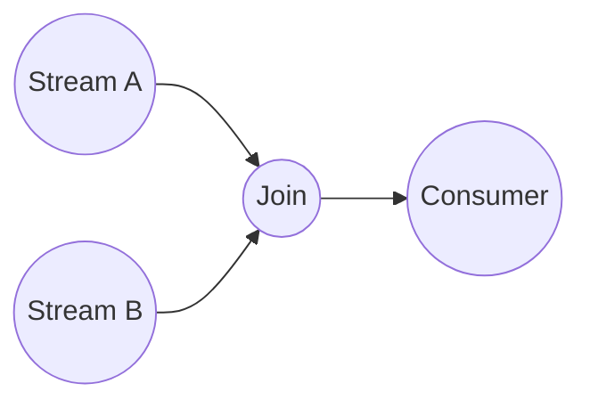

# Data stream processing
Source: Stream processing with Apache Flink, O ´Reilly 2019

## Motivation
- Large amounts of interesting data
- Cannot store it in a harddisk to later analyse it

### Data Stream Processing Applications
- Sensor networks
    - A lot of data from different sources, filtering, alarms, aggrication, joining streams
- Network traffic analysis
    - Real time data
- Financial tickers
- On-line actions
- Transactions log analysis, e.g., Web, telephone calls, ...
Credit card fraud detection

### Motivation for Data Stream Processing
- Increase in performance of disks
- Costly to have good quality storage

### Handling data streams in Data Base System
- Traditional Data Base System
    - Static disk, read and writes
    - Query processing communicates with the main memory and the main memory checks the static disk
    - Pull approach, go inn the disk and pulls out the data

- Data Stream Processing
    - On the fly data analysing
    - Data entering the system
    - Want to analyse each tuple of data or events that are entering
    - Conitnous queries
    - Push approach, go inn the disk/main memory and pushes analysed data

### DBS vs DSP
- NOTE: SE PÅ SLIDE OG GÅ OVER PUNKTENE GRUNDIG
- A lot of trade offs

## Historical development

### Data Stream Management Systems vs Complex Event Processing
- There is a mix, hard to distinguish the different types in the systems

### The evolution
- 1. generation
    - Continiuous queries
    - Inverted DBs
    - How can we model the data in a stream
    - Sliding windows, blocking operators
    - Not enough resources
- 2. generation
    - Map Reduce
    - Scalability
    - Best-effirt processing
    - Out-of-order management
    - State management
    - Proc. Guarantees
    - Reconfiguration
    - Stream SQL
    - How to handle parrallellism, should be fast and quick
- 3. generation
    - Cloud Apps
    - Serverless
    - Actors
    - Transactions
    - HW Accel.
    - Edge Nodes
    - Full SQL
    - State queries

## Fundamentals
- Data stream: Unbounded sequence of tuples/events/records generated continuously over time
- Data touple: ordered list of attribute-value pair including a time stamp

t = (symbol, AAPL), (price, 150.23), (time, 2022-02-14 10:30:00)

#### Latency
- How long does it take to process a tuple/event?
- t_latency = t_output - t_input
- Moder nsystems has a few ms in latency
- Batch processing requires a ll tuples before processing starts

####

#### Query
- A function that processes a data stream and returns a result
- SELECT A.id, B.amount FROM Auction as A JOIN Bid as B on B.auction = A.id

#### Opreator graph
- directed acyclic graph, nodes are operators and vertices are data flows

#### Operators
- constume data from inputs
- perform a computation on them
- produce data to outputs for further processing
- Operators without input port = data source
    - Sensor, stock ticker, credit card transaction
- Operators with output port = data sink 
- SE MER HER

#### State management
- Take care of immidiete results

## Windows
- Small partition of a Data Stream
- Tumbling window
    - Always a fixed size, but how do we meassure size
    - Count based window, window size - 4, 10, 10000, 100000, etc
        - We know how much data we get since we have defiend it
    - Time based windows
        - A time window, every 20min, 1h, 2days, etc
        - Dont know how much data we are getting
    - There are no gaps between the windows
- Sliding window
    - There might be overlap and gaps when moving the window
    - slide factor, how far the window is going to slide
- Session window
    - Interactive users, base the window, time based?
- Parallel windows
    - Analyses data from different sources

## Time
- Every distributed system has their own time
- Can store events locally for then to later send the events later with the stamps
- Processing time, the time of the local clock on the machine where the operator processing the stram is being executed
- **Event time** is the time when the even in the stream actually happened
    - Event-time window

- When should we join the data?
    - We pick the time besed on the time-system we have and what kind of application we are working with
    

## Queries

## Load shedding
Remove data when we have too much

## State management

## Result guarantees

## Checkpoint, savepoint and recovery

## Parrot an insighte into our current reasearch

