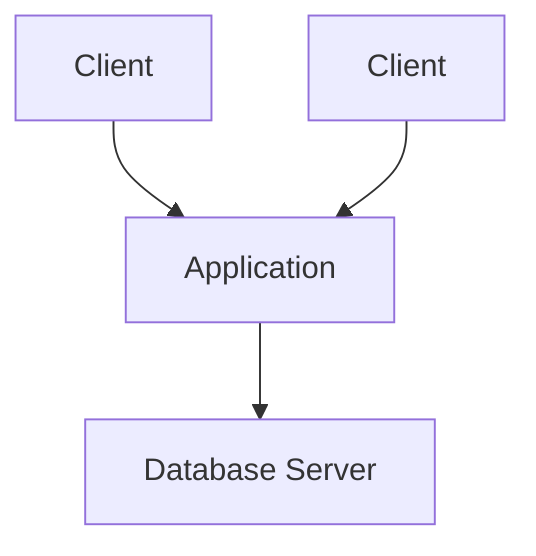
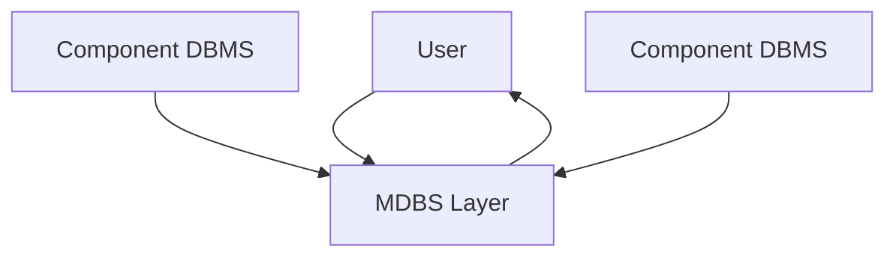

# Distributed Database Systems

### Distributed Computing
- processing logic, function, data, control are being distributed
- need some form of standard to cooperate effeciently

### Current distribution
- Geopgraphically distributed data centers
- need its own software, operating software
- failure is a normal thing
    - redundency, replicating data

### Distributed Database System
- **Distirbuted DB**: collection of multiple, logically interrelated databases distritubted over computer network

- **Distributed DBMS**: software managing distributed DB, provides access mechanism to make distribution transparten to users

### Centralized DBS
- logically integrated
- physically centralized
- not distributed if everything is on a single server

### Distributed DBS (Pair2Pair Dist. DBS)
- Data logically integreated
- Data physically distributed
- processing is distributed among multiple database nodes
- more data volume
- is able to execute parallel execution
- multiple DBS

Note: Top down design is when you start on paper and plan out and start with that. While Bottom up is when you dont start from scratch and you try to use everything you already have (resources).

### Dimensions of the problem
- Distribution
    - if the components are on the same machine or not
- Heterogenity
    - 
- Autonomy
    - 

### Client/Server Architecture
- Limit the access for the client side or give more access
- "Push available functions"
- mostly relational approach
    - all the execution is on the server side, not parallellism
- object-oriented apporach
    - object-relational
    - more on the client-side computing
- add a third layer, application server

### Peer-toPeero (P2P) Component Architecture
- ???

### Multi-DBS Components & Exectution
- already existing DBMS connected to a MDBS layer

### Distributed DBMS Functionality
- important:
    - replication
        - meta-data, where is it stored, index, type of data
        - the data itself
    - failures
    - synchronization
        - when failures happen we have to resynchronize

### Distributed Database Design
- horizontal, distribution of rows
- vertical, distribution of columns
- hybrid, projected columns from selected rows
- allocation, which fragment (vertical or horizontal) is assigned to which node/computed
- replication, how many copies?

- design factors
    - most frequent query access pattern
    - available algorithms
- evaluation criteria
    - cost metric for network traffic, query processing, transation mgmt
    - a system-wide goal: maximize throughput or minimize latency

### Metadata management
- store a directory information
- options
    - centralized, high risk, bottlenecks
    - fully replicated, lack of consistency, hard to update 
    - partioned, complicated access protocol, lack of consistency
    - combination of partioned and replicated
        - zoned or replicated zoned

### Creating 
1. query decomposition, control site (global information)
2. data localization, --||--
3. global optimization, --||--
4. local optimization, local sites (local info)

### ACID:
- A-tomicity, cant be divided into smaller bits, all or nothing
- C-onsistency, contain integrity in multi-usermode , mutual consistency
- I-solation, no interference with the other systems, use locks, locking (CC. mehcanism)
- D-urability, able to recover from failures, the database never loses data

- there is a mutual dependency between the 4 different components above

R-R-R, doesn't need locking  
R-W, dirty reading, not consistent in the transaction  
Locking rows instead of whole table

### CC Apporeaches
- **pessimistic**, validate -> read -> compute -> write
- **optimistic**, read -> compute -> validate -> write
- 

