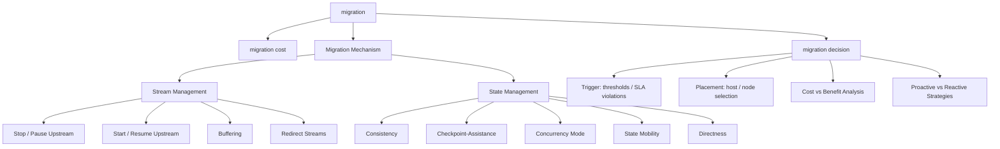

# Scalable Data management, Could data management
- 5 V's of big data
    - volume
    - volatile
    - velocity
    - variaty
    - value

### Cloud computing & architecture
- on-demand, reliable services provided over the internett in a cost-effecient manner
- no need to maintain dedicated compute power
- better at adapting

- IaaS - Infrastructure as a service
    - computing, networking and storage resources
    - elasticity, ability to scale up and scale down
    - Amazon Web Service
- PaaS - Platform as a service
    - platform with developments tools and APIs
    - create applications with the tools from the platform and release/host them on the platform
    - Google Apps 
- SaaS - Software as a service
    - integrating appliations developed by the customer into the platform service
    - can integrate simple applications like email or calander to complex applications like CRM, data analysis or social network
    - Safesforce CRM system
- DaaS - Database as a service

- Scaleability
    - scale out, add more servers
    - scale up, increase the capacity of one server --> has limits

- charactaristics
    - elastic but only if workload is parallalizable
        - applications must be designed to run on non-shareable architecture
    - untrusted hosts
    - data is replicated often across large geographical distances
        - transactions, consistency and privacy?
    
- main issue is privacy and security
    - one solution is to use the cloud service technology but n a private network
    - virtual private network (VPN), difficult but nice

### Big Data Processing Platforms
- data analysis for large datasets or highly dynamic, irregular or schemaless DBS doesnt need full DBMS functionallity
- Parallelization problems
- advantages
    - flexible
    - scaleable
    - effient
    - fault tolarance

- distributed storage system
    - managing and storing data across nodes in a no-share clusters
    - object based
        - objects with an id, metadata and data
        - easy to move
        - flat object space, turns to a lot of objects (billions/trillions)
        - good for many small objects
        - easily accessed through REST API
    - file based
        - metadata per file is stored seperately from the file itself
        - for larger files we split the file up and store it seperataly
        - google file system
            - send a request to a master and the master will relocate the user to the chunk its files are located  at

### Scaleable data management
- horizontal scaling
- shared nothing architectures
- often unstructured
- big web servers, IoT, data nalaysis (DW)
- highly scalable, data size and number of users
- cap theorem
    - can only choose 2 out of 3 of the following: consistency, availability, tolerance for partions
    - relational databases, consistency is essential (ACID properties)
    - distributed systems, service availability is essential (inconsistency tolarated by the user)
    - Consistency - all nodes point to the same data values at the same time
    - Availability - all requests gets an answer
    - Partion tolerance - the system keeps working during a network failure

### NoSQL
- not only sql
- designed dbms for web storage
- specific models like: 
    - key-value stores
        - key = unique id
        - value = text binary data, structured data, ...
        - works basically like a dictionary
        - can also query for the data between two keys
    - document stores
        - hierarichal structure with nesting of elements
        - two main data models: XML and JSON
    - tabular stores: BigTable
        - shared-nothing cluster
        - GFS to manage data
        - basis for opensource implementations
    - graph DBMS
        - very big, billions of nodes and edges
        - a lot of graphs
        - mainly for social networks, master data management, fraud detection in real time, enterprise network, identity management
    - multimodal stores: OrientDB
        - integration of key-value, document and graph
        - uses document objects structure with references to other documents objects to make traversing easier
        - ACID transactions
        - JSON, REST
- main nosql systems

| Vendor | Product | Category | Comments |
|---|---|---|---|
| Amazon | DynamoDB | KV | Proprietary |
| Apache | Cassandra | KV | Open source, originally Facebook |
| Apache | Accumulo | Tabular | Open source, originally NSA |
| Couchbase | Couchbase | KV, Document | Origin: MemBase |
| Google | Bigtable | Tabular | Proprietary, patents |
| Facebook | RocksDB | KV | Open source |
| Apache | HBase | Tabular | Open source, originally Yahoo |
| LinkedIn | Voldemort | KV | Open source |
| LinkedIn | Espresso | Document | ACID transactions |
| 10gen | MongoDB | Document | Open source |
| Oracle | Oracle NoSQL | KV | Based on BerkeleyDB |
| OrientDB | OrientDB | Graph, KV, Document | Open source, ACID transactions |
| Neo4J.org | Neo4J | Graph | Open source, ACID transactions |
| Ubuntu | CouchDB | Document | Open source |

### NewSQL
- NoSQL, scalable, good performance, practical APIs for programming
- Relanational, strong consistency, transactions, easy tools for vendord with standard SQL
- NoSQL/relational hybrid
- stores data across
- uses distributed transaction protocols (two phase commit or deterministic concurrency controll) to maintain ACID properties
- SQL interface for compatibility
- Main NewSQL systems

| Vendor | Product | Objective | Comment |
|---|---|---|---|
| Clustrix Inc., San Francisco | Clustrix | Analytics and transactional | First version out in 2006 |
| CockroachDB Labs, NY | CockroachDB | Transactional | By ex-googlers; open source; inspired by F1; based on RocksDB |
| Google | F1/Spanner | Transactional | Proprietary |
| SAP | HANA | Analytics | In-memory, column-oriented |
| MemSQL Inc. | MemSQL | Analytics | In-memory; column/row-oriented; compatible with MySQL |
| LeanXcale, Madrid | LeanXcale | Analytics and transactional | Based on Apache Derby and HBase; multistore access (KV, Hadoop, CEP, etc.) |
| NuoDB, Cambridge | NuoDB | Analytics and transactional | Solution cloud (Amazon) |
| GitHub | TiDB | Transactional | Open source inspired by Google F1 |
| VoltDB Inc. | VoltDB | Analytics and transactional | Open source and proprietary versions; in-memory |

- Which data store for what?

| Category | Systems | Requirements |
|---|---|---|
| Key-value | DynamoDB, SimpleDB, Cassandra | Access by key Flexibility (no schema) Very high scalability and performance |
| Document | MongoDB, CouchDB, Expresso | Web content management Flexibility (no schema) Limited transactions |
| Tabular | BigTable, HBase, Accumulo | Very big collections Scalability and high availability |
| Graph | Neo4J, Sparcity, Titan | Efficient storage and management of large graphs |
| Multimodel | OrientDB, ArangoDB | Integrated key-value, document and graph management |
| NewSQL | Google F1, CockroachDB, VoltDB | ACID transactions, flexibility and scalability SQL and key-value access |

### Polystores
- provides integrated access to multiple cloud services such as NoSQL, HDFS, RDBMS
- good for integrating structured (relational) and big data
- more difficult than distributed databases
- a major area of research and development
- the new thing?
- loosely-coupled
    - mediator-wrapper architecture
    - one common interface to alle data stores
- Tightly-coupled polystores
    - uses the local interfaces of the data stores instead of wrappers
    - single query language for data intergration in the query processor
    - allows data movement across data stores
    - only has a mediator compared to the loosely coupled architecture
- there is a hybrid version

# Data Stream Processing (Part 3)

### Operator graph
- dataflow graph, execution graph - directed graph that represents how a stream processing job transofmrs incoming data through a series of operators
- Source --> Filter --> Map --> Sink

| **Type**           | **Example**                           | **Description**                             |
| ------------------ | ------------------------------------- | ------------------------------------------- |
| **Source**         | Kafka source, file stream             | Ingests data into the stream (entry point). |
| **Transformation** | Map, FlatMap, Filter                  | Transforms or filters data.                 |
| **Aggregation**    | Window, Reduce, Sum                   | Combines or summarizes data over time.      |
| **Join**           | Stream–Stream join, Stream–Table join | Combines multiple input streams.            |
| **Sink**           | Database, HDFS, Dashboard             | Outputs processed data (exit point).        |

### Apache Flink in Cloud Enviroments - CPU
- when overload happens, scale out
- migrate to other hosts, so split up one host and let others take on the other parts of the state
- update the operator graph

### Data stream processing
- Real-time events --> ingested into a countinous query / application with a state
- updates the key-value store database
- a user interface reads the data and reports live to the user

### Distributed stream processing
- distribute the load over a miltiple networked nodes
- might use select from one node, select on another node and send the data from the selects to a new node that joins them and then sends the joined data to a new node where the consumer is

### Adaptation
- there is a need to adapt to the enviroment
- the enviroment consists of data, number of operators, location of nodes, etc etc. that could change
- done with operator migration and load balancing/elasticity, fault tolrance and Quality of Service
- **all-at-once operator migration**
    - stop stream from upstream nodes
    - buffer tuples at upstream nodes
    - extract operator state at old host
    - transfer operator state to new host
    - redirect streams
    - start streaming of tuples from upstream nodes

### Operate state
- **Processing state** - historical data ncesessary for processing incoming tuples
- buffer state, holds on output tuples that hasnt been forwarded yet
- routing state, next operator for output tuples

MÅ SE MER PÅ
